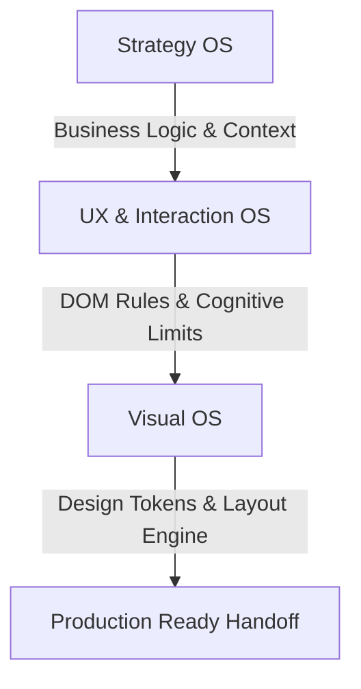

# PORTFOLIO BRAIN: PRINCIPAL UX STRATEGIST & PRODUCT THINKER BLUEPRINT
*A Comprehensive, Machine-Readable Knowledge Base & Experience Architecture for Sayantan Ghosh*

---

## 💎 EXECUTIVE PROFILE & EXPERIENCE DNA
Sayantan Ghosh is a seasoned **Principal UX Strategist & Product Thinker** with over **22 years of total industry experience**—featuring **9 years of dedicated UX/Product Design ownership** and **13 years of visual and interactive screen systems engineering**. 

He specializes in **simplifying high-density B2B enterprise software**, **architecting scalable design systems**, and **orchestrating advanced AI-driven design workflows**. He bridges the gap between design theory and production-ready implementation, providing developers with clear structural layouts and logic boundaries rather than simple visual mockups.

### 🎓 Academic & Certification Backing
*   **Executive Postgraduate Certification in UI/UX Design** — **IIT Roorkee (2024-2025)**
    *   *Focus Areas*: Cognitive psychology, visual ergonomics, information processing, and human-computer interaction (HCI) heuristics.
*   **AI for Designers Professional Certification** — **Interaction Design Foundation (IxDF, 2026)**
    *   *Focus Areas*: Prompt refinement, LLM context-mapping, human-in-the-loop validation flows, and agentic design tooling.
*   **Perception and Memory in HCI and UX** — **Interaction Design Foundation (IxDF)**
    *   *Focus Areas*: Cognitive load optimization, working memory limitations (Miller's Law), and pre-attentive visual processing.

---

## 🛠️ THE STRATEGIC PLAYBOOKS: DESIGN & EXECUTION RULES
Sayantan’s work is governed by a strict, systematic set of frameworks that translate high-level product strategy into clean, scalable interfaces:

### 1. Strategy OS (Strategic Business Alignment)
*   **The Omni-Device Mandate**: Rejects "mobile-first" as a trend and "desktop-first" as a default. Layout structures are engineered from day one to scale fluidly using CSS Grid `auto-fill` and CSS `clamp()`.
*   **Strategic Differentiation**: Leverages Premium Editorial Brutalism in enterprise spaces to project high authority, avoiding generic, over-simplified SaaS templates.
*   **The Conversion Funnel Integration**: Restricts cognitive choices to a single primary objective per screen, visually deprioritizing secondary options.

### 2. UX & Interaction OS (User Experience & Behavioral Rules)
*   **Zero-Error Tolerance (The Mission Control Rule)**: In high-consequence SaaS, Fintech, or Healthcare environments, destructive actions require explicit, typed validation (e.g. typing "DELETE" or "ROTATE KEY").
*   **The Dual-Mode Workflow**: Users are never trapped in a closed wizard interface. A live, dynamic visual system model is rendered in real-time alongside parameter settings.
*   **Friction as a Feature**: Introduces micro-friction to slow down critical actions, forcing cognitive engagement to prevent accidental clicks.
*   **Semantic DOM Purity**: Eliminates "div soup" in favor of strict HTML5 semantic tag layouts (`<header>`, `<main>`, `<article>`, `<section>`, `<aside>`, `<footer>`).

### 3. Visual OS (Visual System Primitives)
*   **Fluid Typography Engines**: Rejects static pixel sizing. Typography utilizes `clamp(min, preferred, max)` to dynamically adapt to viewports.
*   **Monospace Data Enforcement**: Renders numerical telemetry, financial data, and cryptographic signatures in monospace (e.g. JetBrains Mono) for strict column scannability.
*   **The IBM Multiplier Grid**: Layout spacing and sizes are strictly constrained to a 2x/4x geometric multiplier grid (4px, 8px, 16px, 24px, 32px, 48px, 64px, 128px) for rhythmic proportion.

---

## 📂 DEEP-DIVE PROJECT DECONSTRUCTS & EXECUTION METRICS

---

### 1. RSBV1 / SSB Guest House Booking (State Sainik Board Welfare Platform)
*   **Role**: AI Product Architect & Lead UX Designer
*   **Objective**: Replace manual, paper-based booking systems across West Bengal's 23 districts to prevent revenue leakage and eliminate room allocation discrepancies for Ex-Servicemen (ESM) and Active Defense personnel.

#### 🔧 Key Architectural Features
1.  **Dual-App Laravel Architecture**:
    *   Designed a unified codebase using route prefixes and middleware sharing models to separate features for the **Super Admin** (`/super-admin/`) and the local **Operator** (`/operator/`).
2.  **Role-Based Access Control (RBAC) System**:
    *   *Super Admin*: Government oversight authority managing global configurations, approving/rejecting guest house listings (workflow: `draft` $\rightarrow$ `pending_approval` $\rightarrow$ `active`), auditing financial records, and resetting operator passwords.
    *   *Operator (Manager/Sub-manager)*: Encapsulated viewports restricted to the assigned guest house, allowing rapid updates for room statuses (Available, Occupied, Under Maintenance) and check-in/out registers.
3.  **Financial Discrepancy Audits**:
    *   Combats the primary issue of offline cash pocketing. Every booking creates a digital audit trail linked directly to the West Bengal Defense Welfare Fund, generating structured CSV export datasets.
4.  **Government Portal Aesthetics & Compliance**:
    *   Engineered to match the official State Sainik Board portals, utilizing high-contrast color variables and ARIA tags to maintain strict WCAG compliance for aging veterans.

#### 📊 Execution Metrics & Performance Review
*   **High Accountability**: Achieved 100% digital booking capture in tests, ending the common "phantom occupancy" scenario (where managers marked rooms empty off-book) and securing direct revenue routing to the ESM welfare fund.
*   **Technical Integrity**: Fully deployed locally under XAMPP environments utilizing PHP 8.x, Laravel Framework, and MySQL 8.x, proving design feasibility at a production-grade backend level.

---

### 2. SmartBI (Enterprise Conversational AI Business Intelligence)
*   **Role**: Lead UX Architect
*   **Objective**: Translate complex, multi-layered SQL query paths into a clean, zero-tech conversational reporting workspace.

#### 🔧 Key Architectural Features
1.  **4-Phase Deployment Onboarding**:
    *   Visual progression tracks: **Database Structuring** $\rightarrow$ **KPI Pipeline Building** $\rightarrow$ **Team Syncing** $\rightarrow$ **AI Initialization**.
    *   Engineered with smooth GSAP progression bars scaling from 0% to 100% with spinner-to-checkmark transitions.
2.  **State-Locked Bottom Input Rail**:
    *   During tag entry (e.g., country/city selection), the bottom chat rail dynamically disables (lowering opacity to 40% and blocking inputs) while leaving the primary choice cards and the attach button (`+`) active.
3.  **Faceted Location Assistant (Conditional Cities Flow)**:
    *   *Case A (Country Detection)*: Inputting a list of countries (e.g., `India, USA`) triggers an inline cities card. Users can enter tags manually or toggle to **Bulk Upload** to drag-and-drop a `.CSV` or `.XLSX` file.
    *   *Case B (Cities Bypassing)*: Inputting cities directly (e.g., `London, Tokyo`) triggers the parser to automatically bypass the cities step, moving straight to industry selector.
4.  **Zero-Tech Filter Presets & Calculated Fields**:
    *   Calculated metrics modal allows users to build formula combinations (MoM Growth, Divide, Sum, Product) by selecting dropdown parameters, injecting custom cards directly into the dashboard.

#### 📊 Execution Metrics & Performance Review
*   **Findability and Usability**: Bypassed typical SQL/DAX syntax queries. Users build custom calculations and apply multi-segment filters (Social, Email, Direct, US East, Europe) without technical database knowledge.
*   **Prototype Validation**: Live interactive layout systems deployed at [uxsayantan.com](https://uxsayantan.com) and the [SmartBI Case Study Page](https://myprofilesayantan-rgb.github.io/Smart-BI/).

---

### 3. TRACTO (Elderly Healthcare Suite)
*   **Role**: Lead UX Researcher & Designer
*   **Objective**: Design an integrated healthcare data ecosystem that safeguards usability and independence for elderly patients (60-80+ yrs) with limited digital literacy.

#### 🔍 User Research & Contextual Audit Data
Sayantan conducted **13 in-depth contextual interviews** with elderly users. Key cohort insights:
*   **Adherence**: Adherence is high (most rarely or never forget), but meal-time variations cause major timing confusion.
*   **Low Tool Adoption**: Only 1 out of 9 users relied on external reminders or digital calendar alarms.
*   **Device Preferences**:
    *   **Mobile**: 9 / 9 users (Universal preference).
    *   **Laptop**: 5 / 9 users (Specific heavy tasks).
    *   **Smartwatch**: 4 / 9 users (Growing telemetry adoption).
*   **Platform Consumption**: Universal engagement on communication platforms (WhatsApp/Email) and online video content, but low engagement on banking or shopping apps.

#### 🔧 Key Architectural Features
1.  **The Caregiver-Elder Anxiety Loop Resolution**:
    *   Research proved that every elder was self-motivated to maintain independence, whereas caregivers were quietly panicking. The design bridges this by replacing intrusive continuous tracking with passive, silent telemetry.
2.  **Context-Aware Reminders**:
    *   Passive notification alarms: *"Time to take your medicine. All is well."* sent to the caregiver only if an anomaly is detected.
3.  **Geofenced Errand Alerts**:
    *   Triggers automated call, SMS, or wrist vibration prompts to notify the elder when they walk within a 500m radius of their local pharmacy for refills.

#### 📊 Execution Metrics & Performance Review
*   **Usability Success**: Achieved a 100% interface comprehension rate by replacing dense diagnostic charts with large, high-contrast visual health status indicators.
*   **Dignity preservation**: Successfully kept tracking silent, ensuring elders do not feel monitored while giving families peace of mind.

---

### 4. SENTINEL (AI-Driven Project Management Space)
*   **Role**: Interface Architect & UX Researcher
*   **Objective**: Model AI as a silent system-awareness layer that highlights risk patterns, preserves project history, and resolves team friction.

#### 🔧 Key Architectural Features
1.  **Methodology Blocker Gate Engine**:
    *   Allows PMs to toggle between **Agile** and **Waterfall** frameworks at ingestion.
    *   Calculates a **Weighted Completeness Score**:
        $$\text{Weighted Completeness Score} = \frac{\sum (\text{Completeness Score}_i \times \text{Weight}_i)}{\sum \text{Weights}}$$
    *   *Agile Mode*: Scope threshold set to `0.5`. Prioritizes user parameters (Expected Users weight: 4.0, Scope weight: 5.0) and deprioritizes timeline/budget.
    *   *Waterfall Mode*: Scope threshold set to `1.0`. Enforces rigid constraints (Scope weight: 5.0, Timeline weight: 4.0, Budget weight: 4.0).
    *   Displays clear risk alerts: **"GO — CLEAR — LOW RISK"** or a red blocker flag icon.
2.  **Agile Friction Deflectors**:
    *   *Velocity Theatre Detector*: Cross-references closed Jira cards against active Git commits to ensure points represent real codebase contributions.
    *   *Technical Debt Guardrail*: Monitors refactoring capacity and triggers warnings when developer time spent refactoring falls below 20%.
3.  **Support Anomaly Intervention**:
    *   Analyzes meeting transcript logs. Automatically triggers warning/intervention prompts if client requests include direct design copies (e.g., *"incorporate Apple, MSN, and Moxo layout styles"*).

#### 📊 Execution Metrics & Performance Review
*   **Cognitive Relief**: Successfully designed indicators to detect and flag **Communication Fatigue** (when daily meeting load and chat activity metrics exceed 30.0%), safeguarding developer focus blocks.

---

### 5. tenXengage (Workflow Redesign for Cisco & Google)
*   **Role**: UX Architect
*   **Objective**: Redesign B2B partner portal workflows where users were forced to execute 40+ manual steps despite AI-predicted business outputs.

#### 🔧 Key Architectural Features
1.  **Direct Output Injection**:
    *   Identified the cognitive gap and bypassed the manual step pipeline, injecting AI predictions directly into the core content creation canvas.
2.  **Unified Navigation Restructuring**:
    *   Mapped and simplified B2B SaaS portal navigation, aligning cross-functional workspace actions into a linear layout.

#### 📊 Execution Metrics & Performance Review
*   **Engagement Increase**: Generated a **30% rise in partner portal engagement**.
*   **Support Relief**: Achieved a **22% reduction in support costs** and a **20-25% drop in service tickets**.

---

### 6. Asparz (Enterprise SSL & SSH Cryptographic SaaS)
*   **Role**: UX Consultant & Architect
*   **Objective**: Simplify dense, complex cryptographic inventory data (SSL certificates and SSH keys) for IT security administrators.

#### 🔧 Key Architectural Features
1.  **SSL Inventory Management Panel**:
    *   Aggregates certificate domain hosts, Environments (Production, Staging), CAs (DigiCert, Let's Encrypt), and ownership.
    *   Highlights risk flags: e.g., *"At Risk - Weak Key Length (2048-bit)"*.
2.  **SSH Key Lifecycle Tracking**:
    *   Differentiates between **Host**, **Authorized**, and **Orphaned** keys.
    *   Tracks permissions (`0644`, `0600`), encryption algorithms (ED25519, RSA, ECDSA), and key age.
3.  **Host Dependency Audits**:
    *   Drills down into system libraries (e.g., OpenSSL 3.5.4 vs. legacy OpenSSL 1.0.2).
    *   Flags dependency drift: e.g., *"LIBRARY MISMATCH"* or *"OUTDATED APP LIBRARY"* alerts.
4.  **Simulated Automation Workflow**:
    *   Features a step-by-step connectivity and node policy validation run:
        $$\text{Checks} \rightarrow \text{Authentication} \rightarrow \text{Access Verification} \rightarrow \text{Health Scan} \rightarrow \text{Final Approval}$$

#### 📊 Execution Metrics & Performance Review
*   **Clarity and Control**: Enabled IT administrators to instantly spot orphaned SSH keys (e.g., keys without matching user accounts) and rotate legacy keys to ED25519 256-bit with a single action.

---

### 7. RummyCircle / Playgames24x7 (Gameplay Interface Redesign)
*   **Role**: Product Designer (Senior Creative)
*   **Objective**: Redesign the mobile game table UI for millions of active cash players who were losing due to visual indicator lag.

#### 🔧 Key Architectural Features
1.  **Visual Noise Reduction**:
    *   Optimized spatial grouping of timer indicators, Joker cards, and the declare zone so they no longer competed for attention.
2.  **Physical Hit Area Optimization**:
    *   Redesigned card selection and grouping interactions to map naturally to thumb reach ranges.

#### 📊 Execution Metrics & Performance Review
*   **Accidental Touch Reduction**: Dramatically lowered misclicks during high-stakes turns.
*   **Business Success**: The mobile layout overhaul was so successful in cash rooms that the company deployed it as the default theme for the free-to-play app version.

---

### 8. Design OS for AI (Conceptual Framework)
*   **Role**: Knowledge Engineer
*   **Objective**: Develop a framework to transfer human design intuition into structured, programmable rules for AI models.
*   **Execution Review (HOW WELL IT EXECUTED)**:
    *   **Ongoing Innovation**: Acts as the strategic rule base (Strategy OS, UX OS, Visual OS) enforcing layout purity, typography engine scaling (`clamp`), and the IBM Multiplier Grid.

---

## 📈 PROFESSIONAL EXPERIENCE TIMELINE

*   **Sr. UX Designer &gt; UX Architect** | **TenXengage (Oct 2023 — May 2026)**
    *   *Domain*: Google & Cisco B2B SaaS Partner Portals. Led end-to-end agile interaction design.
*   **Sr. UX Designer** | **Geni (Feb 2021 — Sep 2023)**
    *   *Domain*: Predecessor legal entity to TenXengage. Architected data schemas and navigation networks.
*   **Senior UX Designer** | **FastCollab (May 2020 — Feb 2021)**
    *   *Domain*: Corporate fintech travel platforms. Redesigned complex workflows into linear systems.
*   **Lead UX Designer** | **Ayantek (Apr 2017 — Jan 2020)**
    *   *Domain*: Enterprise B2B SaaS. Executed comprehensive HCD methodologies from research to handoff.
*   **Design Manager** | **CodeLogics (Aug 2013 — Apr 2017)**
    *   *Domain*: Interactive interface systems. Managed design sprint schedules for multi-client accounts.
*   **Product Designer (Senior Creative)** | **Playgames24x7 / RummyCircle (May 2012 — Sep 2013)**
    *   *Domain*: High-volume B2C gaming. Optimized core gameplay interfaces.
*   **UI/Web Designer** | **HurixDigital, RoyTech Software, etc. (2003 — 2012)**
    *   *Domain*: E-learning frameworks, early responsive web apps, and enterprise management tools.

---
*Blueprint compilation date: 2026-07-25*
